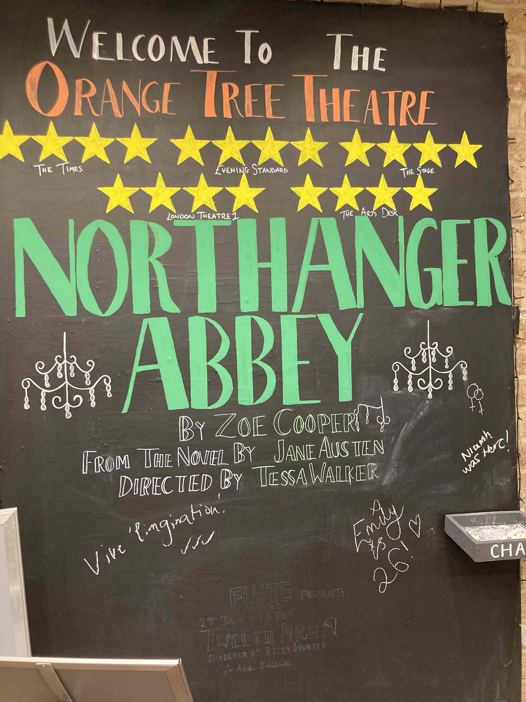

Okay, this _really_ is something completely different!

I think theatre would be considered pretty far outside of my comfort zone.
If you exclude the two musicals I watched, the last time I watched a play was in like... 2011, and that was only because I was crushing very hard on a theatre girl.
(Oh, Penny.)

But I was somewhat unexpectedly asked if I wanted to go for this by a colleague, who was friends with one of the cast.
Being probably the number one Austen fan in the office, I said yes, and was particularly gratified to find that the theatre was at Richmond, pretty close to where I am in West London.
I figured that I would at least know something about the story!

I think the play did manage to stay quite close to the actual events in the story.
With a three-person cast, some things naturally had to be cut: for example Frederick Tilney, who plays an important role in the original story by separating Isabella from James.
But we got all the good stuff: Henry talking muslins, the trip to Blaise Castle, Catherine finding the laundry list, sneaking into the late Mrs Tilney's room, and so on.

## Queering Austen

The most intentional, and inescapable, deviation from the plot was the elevation of Catherine and Isabella's relationship to a romance.
(The [promotional material](https://orangetreetheatre.co.uk/whats-on/northanger-abbey/) does not shy away from this!)

The basis for pairing Catherine and Isabella is, of course, the very rapid and passionate intimacy they develop in Bath.
(It's worth mentioning that Catherine also gets equally emotionally attached to Eleanor Tilney, who had only a very small role in the play.)

But also, Henry Tilney has never been intended to be a romantic, physically attractive, hero à la Mr Darcy.
There is no doubt deep affection between Catherine and Henry, but without the intensity that we see in some of Austen's female/female relationships.
In this way, the canonical Catherine/Henry pairing mirrors that of Emma and Mr Knightley (in *Emma*), or Fanny and Edmund (in *Mansfield Park*).

Of course, readers of the novel will rightly point out that the relationship between Catherine and Isabella is largely manufactured by Isabella, and that the hapless and naive Catherine is essentially being manipulated.
There is a brilliant video by Dr Octavia Cox which goes into how Austen characterises Isabella:

<iframe width="100%" height="315" src="https://www.youtube.com/embed/Ms7-Mzhl8x0?si=JylPWYF4sGxXW1s2" title="YouTube video player" frameborder="0" allow="accelerometer; autoplay; clipboard-write; encrypted-media; gyroscope; picture-in-picture; web-share" allowfullscreen></iframe>

Yet, I _like_ this adaptation.
It's notable that scholars have pointed out sapphic subtext in the two works I briefly alluded to above.
(The female romantic interest in each case is, of course, Harriet Smith and Mary Crawford.)
Going even further, [Terry Castle's suggestion](https://www.lrb.co.uk/the-paper/v17/n15/terry-castle/sister-sister) that the relationship between Austen herself and her sister Cassandra 'had its unconscious homoerotic dimensions' sparked a great deal of controversy many years ago (and still does).

Of course, we cannot definitively know anything about Austen's sexuality, or how she intended for her characters to be read.
But I find it quite frustrating that often suggestions of lesbian relationships in Austen's works are shut down, as if one should not even dare to utter these ideas.

The problem with such a dismissive attitude (which I've seen numerous times online) is that this can really become self-perpetuating.
By asserting that Austen (or any other writer) wasn't writing about lesbians, we indirectly reinforce the notion that lesbians didn't exist, which then implies that Austen couldn't have been writing about them.
(Similar problems exist with historic representation of women in science and in classical music, for example.)

So, it's nice to see something different.
Sure, it may take some liberties with the source; but in doing so, it liberates us from what is usually interpreted as an overwhelming heteronormativity of the 19th-century literary canon.

## Did I enjoy it?

Yes!
But I won't give a rating, because I don't have a baseline to compare against.
I thought the acting was fantastic.
Having made one shameful attempt at it in a previous life, I'm pretty sure I could never do such a thing.

Ultimately, I guess this post was just a vehicle for me to talk about my favourite author. :-)
