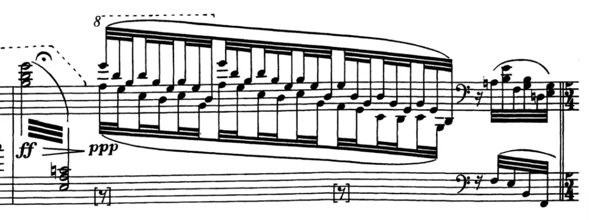

## Programme

**19:30, 19 October 2024, Wigmore Hall**

Alexandre Tharaud piano

- Bach: various transcriptions
  - St Matthew Passion, BWV244: Chorus
  - Flute Sonata in E flat, BWV1031: Siciliano
  - Suite in A minor, BWV818a
  - St Matthew Passion, BWV244: _Aus Liebe will mein Heiland sterben_
  - Suite in E minor, BWV996
  - Organ Concerto in D minor, BWV595: Siciliano
- Ravel: Miroirs
- Dukas: The Sorcerer's Apprentice

https://www.wigmore-hall.org.uk/whats-on/202410191930

------------

Tonight's programme mainly consisted of transcriptions of various Bach pieces as well as Dukas's most famous piece, _The Sorcerer's Apprentice_.
Almost all of the transcriptions were written by Tharaud himself, and the programme notes made a point of emphasising that transcribing is in itself a form of artistry.
This is certainly true in that there are very many stylistic, harmonic, and textural choices which can be included in a transcription: two different people may indeed come up with very different versions of a source material.

I think some of them worked very well, and some less so.
Generally, my issue with piano transcriptions is that they become much more one-dimensional in terms of timbre.
Consequently, if the original music involves any moderately complex instrumentation, it's very difficult to accurately capture the sense of that.
To me, this is illustrated very well in Liszt's piano transcriptions: he was obviously a highly skilled musician, but some of them are hits (Schubert lieder) and some misses (Beethoven symphonies).

The performances today didn't really change my opinion on this front.
The arrangement of the _Siciliano_ from the E flat major Flute Sonata – written for flute and keyboard – was very enjoyable.
Likewise, the transcription of the BWV 996 suite for lute sounded as natural as one of Bach's keyboard suites.
But I found that the transcription of _Aus Liebe will mein Heiland sterben_ from the St Matthew Passion didn't really have enough of a distinction between the flute and the soprano parts; the interplay between these two being the key defining feature of this aria.
Maybe less is more when it comes to transcriptions?

As for Tharaud's playing, it is arresting, confident, very technically assured, and purposeful.
As I write this I am actually listening to his Goldberg Variations ([YouTube link here](https://www.youtube.com/watch?v=yMTBrHm3FS8)) and I am enjoying it very much (even if 1986 Decca Schiff is still my favourite).
I loved his pedalling in the Ravel, especially this single measure in _Noctuelles_ where the _ff_ started off as a very clear tremolo but blended into a wash of sound at the end of the diminuendo.
(As someone thinking of maybe buying a piano some time in the next year, I'm reminded that pedalling is one of the things which is really hard to practice with a digital piano, and that it's also one of the crudest aspects of my piano playing.
I think the effects that professional pianists can accomplish with the pedal are nothing short of magical.)

Perhaps my only complaint is that a little too overtly virtuosic for my tastes.
It did make for a very impressive _Alborada del gracioso_ in the Ravel, though, with the tempo gradually increasing to a frenzy at the very end.
(I was quite impressed that nobody clapped!)

Finally, oddly, I seem to think that there were some deviations from the published programme.
It's not that I really minded it (I'm just happy to have the chance to listen to live music for a fairly low price), but I think the Organ Concerto _Siciliano_ was cut, and the opening piece was definitely not a chorus from the St Matthew Passion, but rather the opening chorus from the St John Passion (_Herr, unser Herrscher_).

23/10/2024: Edited to add that I've found the first of the two encores that Tharaud played; it's a Poulenc improvisation, _Hommage a Edith Piaf_.
There's a YouTube recording of it [here](https://www.youtube.com/watch?v=z5ACQjroULo).
